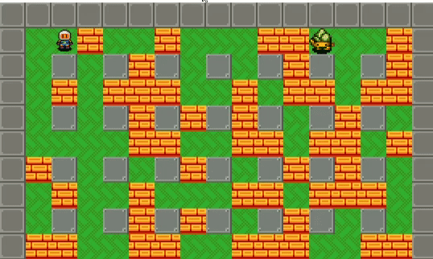

# Enhanced-DynaBlaster-Bomberman

### Details

It was a team project. However, I worked a lot on this. One of the things I'm proud of is the explosion and its animation.

### Short description

Worked hard to realize an enhanced version of DynaBlaster Bomberman.Trying to keep the original gameplay, I enhanced the textures and
feeling of the game.

You have to destroy lots of stone blocks and clear all the enemies so you can move on to the next level by entering the blue portal.

You can die if the bomb hits you! So be careful where you place it.

Once every two levels, one more enemy is spawned. But don't worry, you can find powerups that will help you through the journey.

When you hit level 10, the map will change.

